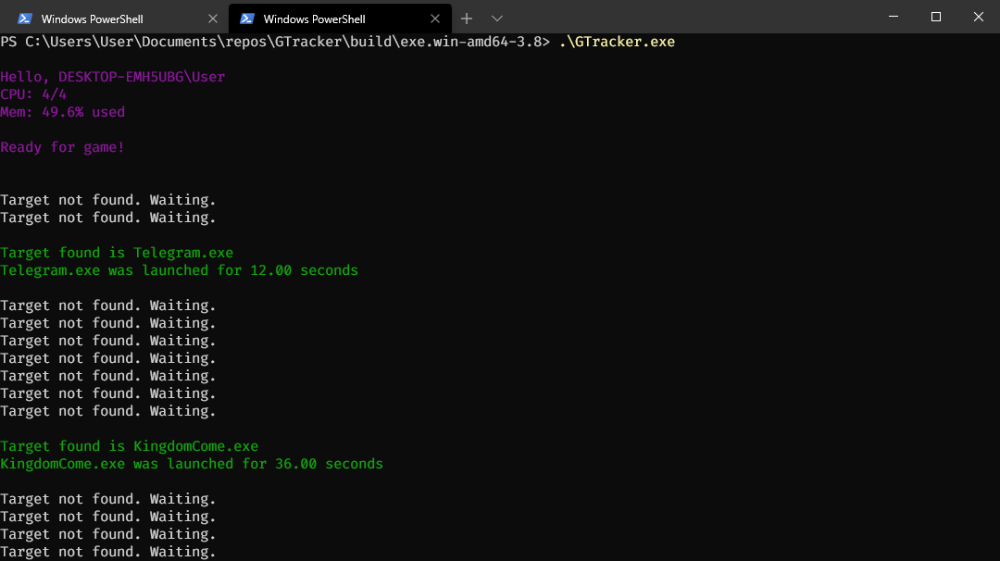

# GTracker

GTracker is a tracker of your time spent playing games.



## How its work

GTracker checks if a process from the list is running, 
and if it finds one, it records the time.

## How to install

#### I have Windows, what to do
Ready to run executables [here](https://github.com/viktor02/GTracker/releases/latest)

It is assumed that you add GTracker to startup - in this case, you need to download the no-console version and add the exe file to startup. Also, do not forget to add the file name of your game to the text file with games (`games.txt`)

For example, if you are playing in Kingdom Come: Deliverance, so you need to add the line `KingdomCome.exe` to the `games.txt` file

#### Where can I get the file name?
You will definitely find it if you google `*YourGame* exe file`

Tips: or you can start the game and find the file in running processes


### How to install manually (Linux, Windows, Mac?)
1. Install requirements
```
python3 -m pip install -r requirements.txt
```
2. Add the main binary file of your game to the `games.txt`
3. Run program `python3 main.py`


### How to build with cx_freeze
#### Install requirements
1. Install cx_freeze, psutil

#### Build no-console

2. In the setup.py file change `base = "Console"` to `base = 'Win32GUI'`

#### Build with console

2. In the setup.py file change `base = "Win32GUI"` to `base = 'Console'`

#### Run the build-command
3. Run `python setup.py build`
OR if you want get the MSI file `python setup.py bdist_msi`
